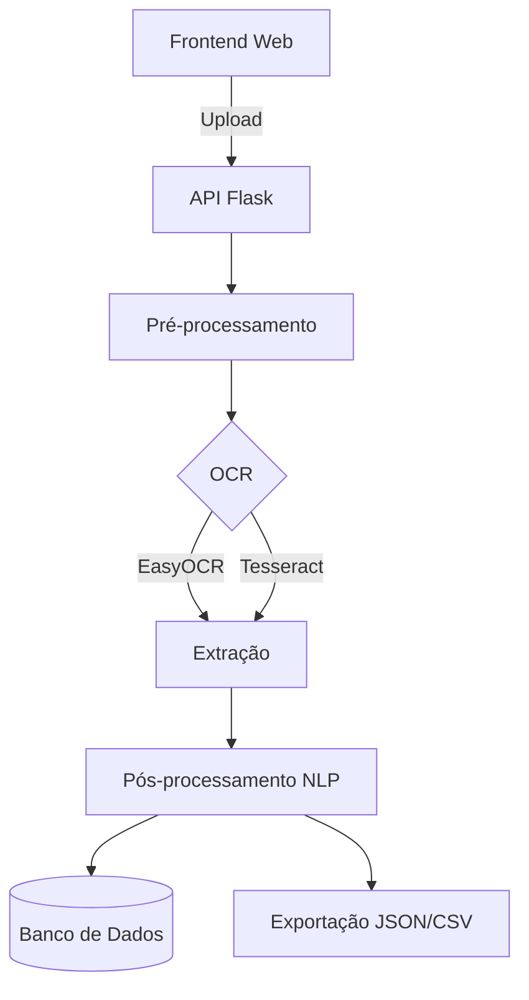
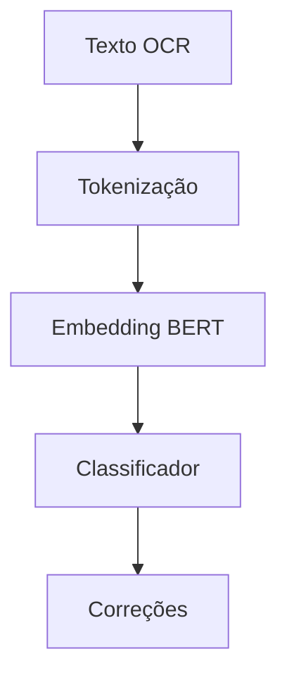

**OCR Brazcubas - Documentação Técnica**  

---

### **1. Introdução**  
**1.1 Objetivo**  
Este documento detalha a arquitetura, funcionamento e especificações técnicas do sistema OCR Brazcubas, solução especializada em reconhecimento óptico de caracteres para documentos brasileiros.

**1.2 Escopo**  
Cobre:  
- Fluxo de processamento  
- Tecnologias utilizadas  
- Modelos de IA  
- Formatos de saída  

---

### **2. Arquitetura do Sistema**  
**2.1 Diagrama de Fluxo** 



**2.2 Componentes Críticos**  
| Módulo | Tecnologia | Função |
|--------|-----------|--------|
| Frontend | HTML5/Bootstrap | Interface de upload |
| Backend | Flask/Python | API REST |
| Processamento | OpenCV 4.5+ | Filtros e ajustes |
| OCR | EasyOCR 1.4+ | Reconhecimento primário |
| NLP | BERT PT-BR | Correção textual |

---

### **3. Especificações Técnicas**  
**3.1 Requisitos Mínimos**  
- CPU: 4 núcleos  
- RAM: 8GB (16GB recomendado)  
- GPU: Opcional (acelera processamento IA)  

**3.2 Dependências**  
Lista completa em `requirements.txt`:  
```
flask==2.0.1
opencv-python==4.5.5
easyocr==1.4
transformers==4.30
```

---

### **4. Pipeline de Processamento**  
**4.1 Fluxo Detalhado**  
1. **Entrada**  
   - Formatos aceitos: JPG, PNG, PDF (até 20MB)  
   - Validação automática de resolução (mín. 300dpi)

2. **Pré-processamento**  
   ```python
   def preprocess(img):
       gray = cv2.cvtColor(img, cv2.COLOR_BGR2GRAY)
       clahe = cv2.createCLAHE(clipLimit=2.0, tileGridSize=(8,8))
       return clahe.apply(gray)
   ```

3. **Reconhecimento**  
   - Configuração EasyOCR:  
     ```python
     reader = easyocr.Reader(['pt'], gpu=False)
     ```

4. **Pós-processamento**  
   - Modelo BERT aplicado quando confiança < 90%  

---

### **5. Modelos de IA**  
**5.1 Arquitetura NLP**  


**5.2 Especificações do Modelo**  
| Parâmetro | Valor |
|-----------|-------|
| Modelo Base | BERTimbau (neuralmind) |
| Parâmetros | 110M |
| Acurácia | 92.4% (testes internos) |
| Vocabulário | 30k tokens PT-BR |

---

### **6. Formatos de Saída**  
**6.1 Exemplo JSON**  
```json
{
  "metadata": {
    "versao": "1.0",
    "data_processamento": "2023-11-20"
  },
  "resultados": {
    "texto_completo": "...",
    "campos_especificos": {
      "cnpj": "12.345.678/0001-90",
      "itens": [
        {
          "descricao": "PRODUTO X",
          "quantidade": 2,
          "valor_unitario": 50.00
        }
      ]
    }
  }
}
```

**6.2 CSV Estruturado**  
```
CNPJ,VALOR_TOTAL,ITEM_QTD,ITEM_DESC
"12.345.678/0001-90",150.75,2,"PRODUTO X"
```

---

### **7. Apêndices**  
**7.1 Códigos de Erro**  
| Código | Descrição | Solução |
|--------|-----------|---------|
| 400 | Formato inválido | Verificar extensão do arquivo |
| 500 | Falha no OCR | Reenviar com melhor resolução |

**7.2 Referências**  
- Documentação EasyOCR  
- Paper BERTimbau  
- OpenCV CLAHE  